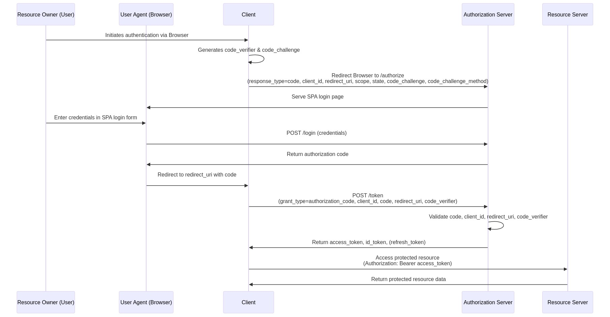

# OpenIddict Authorization Server

This project demonstrates how to implement an [OpenIddict](https://github.com/openiddict/openiddict-core) Authorization Server using the **OAuth 2.0 Authorization Code Flow with PKCE**. 
It highlights best practices and explains security risks when designing login flows, especially when using a SPA as the login interface.

## Table of Contents

- [OAuth 2.0 Authorization Code Flow with PKCE](#oauth-20-authorization-code-flow-with-pkce)
- [Security Risks: SPA as Authorization Server Login Page](#security-risks-spa-as-authorization-server-login-page)
  - [XSS Vulnerability](#xss-vulnerability)
  - [CSRF Risks](#csrf-risks)
- [Give a Star](#-give-a-star)
- [Resources](#resources)

## OAuth 2.0 Authorization Code Flow with PKCE

This flow is the most secure way to authenticate clients, including credential clients (SSR web application) and public clients (SPA, mobile apps).

## Security Risks: SPA as Authorization Server Login Page

Using a SPA as the Authorization Server's login page, which calls a /login endpoint to authenticate users, introduces significant security risks.

### SPA Login Flow Overview

The following shows an attempted OAuth 2.0 Authorization Code Flow with PKCE where the login page is implemented as an SPA that calls a /login endpoint:

### XSS Vulnerability

The next diagram illustrates how an XSS attack could compromise the SPA login page:

Assuming the SPA login page uses HTTP-only cookies to store sensitive data instead of browser storage, which are directly accessible to XSS attacks.
While HTTP-only cookies reduce some risks, they don't eliminate XSS vulnerabilities in an SPA login page for the following reasons:
- XSS attacks can still capture credentials (username and password) before it's sent to the /login endpoint. 
For example, a malicious script can attach a keylogger to the login form or intercept form submissions, stealing credentials.
- An XSS attack can modify the SPA's JavaScript logic, altering how it interacts with the /login endpoint. 
For instance, the attacker could forge requests or redirect the SPA to a malicious endpoint, even if HTTP-only cookies are used.
- If the /login endpoint returns an authorization code or other sensitive data to the SPA, this data is processed by the browser’s JavaScript environment, making it vulnerable.

Use server-side rendered login page greatly reduces the attack surface for XSS:

- The authorization code is generated on the server and sent via a redirect, never exposed to browser JavaScript. As a result, XSS cannot steal OAuth artifacts.
- Content Security Policy (CSP) can effectively block keyloggers, and server-side logic ensures sensitive tokens and codes remain secure.

### CSRF Risks

SPA login flows may also be vulnerable to CSRF (Cross-Site Request Forgery) attacks:

- The /login endpoint often requires CORS configuration, which can be misconfigured and expose vulnerabilities.
- A server-rendered login page operates on the Authorization Server's origin, eliminating the need for CORS.
- A server-rendered login page can use SameSite cookies to prevent CSRF attacks, as the browser will not send cookies with cross-origin requests.
- A server-rendered login page can also use CSRF tokens to protect against CSRF attacks. 
The server generates a unique token for each session and includes it in the login form. 
When the user submits the form, the server verifies the token before processing the request.
- While CSRF attacks can be mitigated in SPAs using those above techniques, they are more complex and error-prone compared to server-rendered login pages.

## Implementation with OpenIddict

This diagram illustrates the implementation of the Authorization Code Flow with PKCE using OpenIddict:

## ⭐ Give a Star

If you found this project helpful, please ⭐ star the repository on [GitHub](https://github.com/chicuong2k3/OpenIddictIdentityServer)!

## Resources

- [OpenIddict Documentation](https://documentation.openiddict.com/)
- [The OAuth 2.0 Authorization Framework](https://datatracker.ietf.org/doc/html/rfc6749)
- [Proof Key for Code Exchange](https://datatracker.ietf.org/doc/html/rfc7636)
